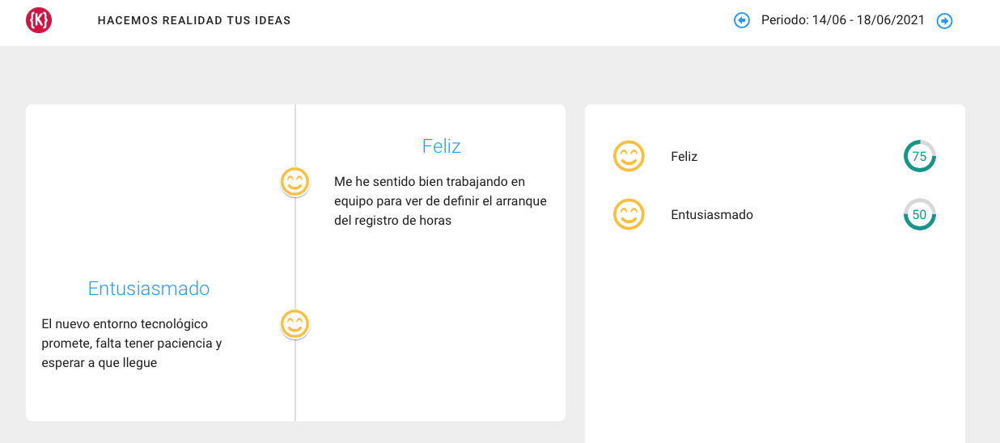
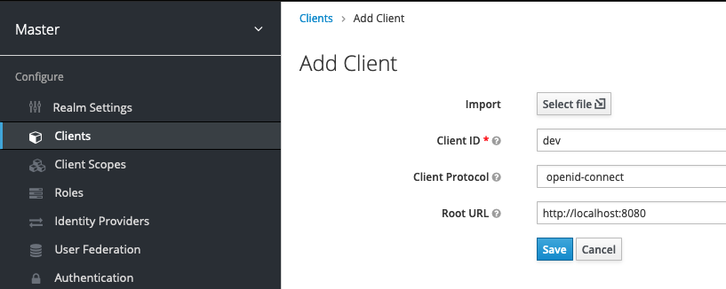

Team Morale
===========
App to assess team morale over time



Getting started
---------------
## Access to the application
```
http://localhost:8080
```
## Keycloak installation
1) Install docker
2) Create keycloak instance

```shell script
docker run -p 8000:8080 -e KEYCLOAK_USER=admin -e KEYCLOAK_PASSWORD=admin jboss/keycloak 
```
See: [Getting started on keyckloak](https://www.keycloak.org/getting-started/getting-started-docker)

3) Create a client
- We need to access the administration console
- On realm master, create the dev client
```
http://localhost:8000
```



DEV Guide
---------
## About Quarkus
This project uses Quarkus, the Supersonic Subatomic Java Framework.

If you want to learn more about Quarkus, please visit its website: https://quarkus.io/ .

## Running the application in dev mode: API + UI
See: [Vue JS with Quarkus](https://medium.com/@dmi3coder/build-run-and-deploy-vuejs-app-with-quarkus-d6d1ae94ced9)
```shell script
./mvnw compile exec:exec@npm-watch quarkus:dev
```
## Running the application in dev mode: API
You can run your application in dev mode that enables live coding using:
```shell script
./mvnw compile quarkus:dev
```

> **_NOTE:_**  Quarkus now ships with a Dev UI, which is available in dev mode only at http://localhost:8080/q/dev/.

## Running the application in dev mode: UI
You can run on dev mode only on UI
```shell script
cd src/mail/webapp
npm run serve
```
### Compiles and minifies for production
```
npm run build
```
### Lints and fixes files
```
npm run lint
```

### Customize configuration
See [Configuration Reference](https://cli.vuejs.org/config/).

## Packaging and running the application

The application can be packaged using:
```shell script
./mvnw package
```
It produces the `quarkus-run.jar` file in the `target/quarkus-app/` directory.
Be aware that it’s not an _über-jar_ as the dependencies are copied into the `target/quarkus-app/lib/` directory.

If you want to build an _über-jar_, execute the following command:
```shell script
./mvnw package -Dquarkus.package.type=uber-jar
```

The application is now runnable using `java -jar target/quarkus-app/quarkus-run.jar`.

## Creating a native executable

You can create a native executable using: 
```shell script
./mvnw package -Pnative
```

Or, if you don't have GraalVM installed, you can run the native executable build in a container using: 
```shell script
./mvnw package -Pnative -Dquarkus.native.container-build=true
```

You can then execute your native executable with: `./target/team-morale-1.0.0-SNAPSHOT-runner`

If you want to learn more about building native executables, please consult https://quarkus.io/guides/maven-tooling.html.

Related guides
--------------
## Provided examples

### RESTEasy JSON serialisation using Jackson

This example demonstrate RESTEasy JSON serialisation by letting you list, add and remove quark types from a list. Quarked!

[Related guide section...](https://quarkus.io/guides/rest-json#creating-your-first-json-rest-service)

License
-------

Licensed under the [GNU Lesser General Public License, Version 3.0](https://www.gnu.org/licenses/lgpl.txt)