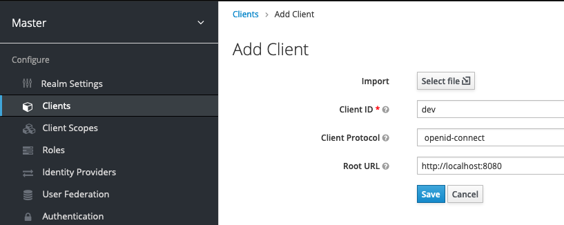

# Keycloak installation
1) Install docker
2) Create keycloak instance

```shell script
docker run -p 8000:8080 -e KEYCLOAK_USER=admin -e KEYCLOAK_PASSWORD=admin jboss/keycloak 
```
See: [Getting started on keyckloak](https://www.keycloak.org/getting-started/getting-started-docker)

3) Create a client
- We need to access the administration console of keycloak
- On realm master, create the dev client
```
http://localhost:8000
```

